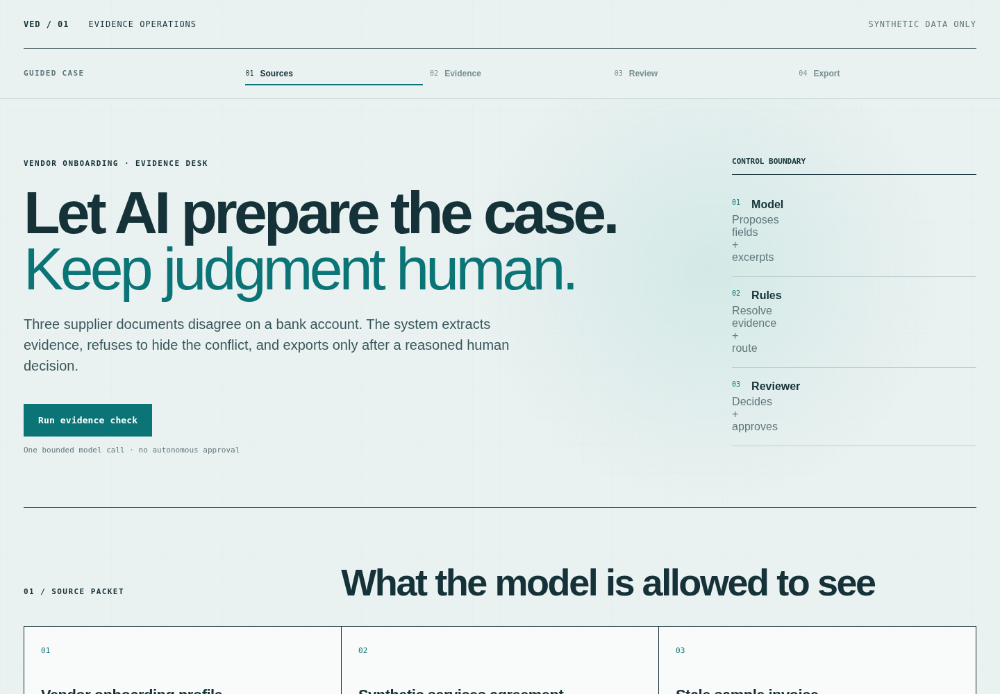

# Vendor Evidence Desk

Watch three document analyzers prepare an evidence-backed vendor record, preserve consequential conflicts, and stop for an accountable human decision.

[Open the live demo](https://vendor-evidence-desk.vercel.app/) · [Read the evaluation design](docs/EVALS.md)

This compact AI/full-stack case study accepts one synthetic, allowlisted supplier packet—not uploads or user prompts. One bounded analyzer processes each document in parallel. A deterministic reducer validates exact excerpts, merges equivalent values, and keeps the `4421` / `9921` bank conflict unresolved.

The Case Lab exposes the completed execution as a fork-and-join trace. A reviewer can inspect each worker, its exact source input, token usage and evidence; approve only a grounded candidate; then change the invoice and see two unchanged workers reused while one runs again. The prior approval remains historical and the successor becomes the only current revision.



## Why this exists

Supplier onboarding is not just extraction. The product decision is to automate preparation while keeping consequential judgment explicit. The demo proves that boundary without pretending to be a production ERP, an adopted customer system, or a general document platform.

## Run it

```bash
pnpm install
cp .env.example .env.local
pnpm dev
```

Without credentials the UI uses a versioned replay labeled as such. Set `OPENAI_API_KEY` and `LIVE_AI_ENABLED=1` for live analyzers. Apply `schema.sql` and add `DATABASE_URL` for revision history and idempotent approval/export; without it the UI explicitly says `preview memory`.

```bash
pnpm verify       # lint, types, exactly 5 tests, production build
pnpm eval         # 5 cases × 3 live analyzers + calibrated LLM judge
pnpm release-db   # isolated migration/CAS/idempotency rehearsal
```

## Verified release evidence

On 2026-08-28:

- 5/5 deterministic tests passed; lint, typecheck and production build passed.
- 5/5 live eval routes and calibrated judge verdicts passed; all 15 document analyzers completed live.
- Requested model `gpt-5.5` returned the required snapshot `gpt-5.5-2026-04-23`; both identities are part of reuse eligibility.
- An isolated Neon schema passed migration rollback, legacy fidelity, concurrent successor CAS, exact approval/export idempotency and cleanup.
- Desktop and 390 px mobile QA passed without browser alerts or horizontal overflow.
- The tracked implementation contains 1,340 non-empty executable/config lines under a 1,450-line hard ceiling.

## Engineering choices

- OpenAI Responses API with strict JSON Schema; documents are untrusted data and analyzers receive no tools.
- Three document-local workers run concurrently; one deterministic reducer owns validation and routing.
- HMAC capabilities bind lineage, exact revision and decision digest before approval or selective reanalysis.
- A successor recomputes only the changed document; unchanged workers are reused only when their input and effective model identities match.
- One Next.js Route Handler keeps credentials server-side.
- One PostgreSQL table stores immutable revision payloads, current/superseded validity and idempotent receipts.
- Exactly five tests protect the high-value authority boundaries; five live evals are regression evidence, not an accuracy claim.

See the [evaluation design](docs/EVALS.md) and [human–AI build process](docs/BUILD_PROCESS.md). All companies, people, identifiers, addresses and bank details are fictional.

## Technical review path

The shortest code review is four stops:

1. [`lib/ai/worker.ts`](lib/ai/worker.ts) → [`run.ts`](lib/ai/run.ts) — strict output, one document worker, parallel orchestration, selective reuse and trace.
2. [`lib/domain/case.ts`](lib/domain/case.ts) → [`evidence.ts`](lib/domain/evidence.ts) — identity, untrusted-output validation, grounding and deterministic routing.
3. [`tests/ai.test.ts`](tests/ai.test.ts) + [`revisions.test.ts`](tests/revisions.test.ts) — five authority-boundary regressions over AI and revision behavior.
4. [`evals/run.ts`](evals/run.ts) — five live cases plus an independently calibrated LLM judge.

## Limits

One known English document shape, no OCR, no authentication, no arbitrary uploads, no real ERP, and no claim of scale or customer adoption. The platform rate-limit rule was verified but is intentionally disabled during owner testing; the OpenAI project hard spend cap remains active.
